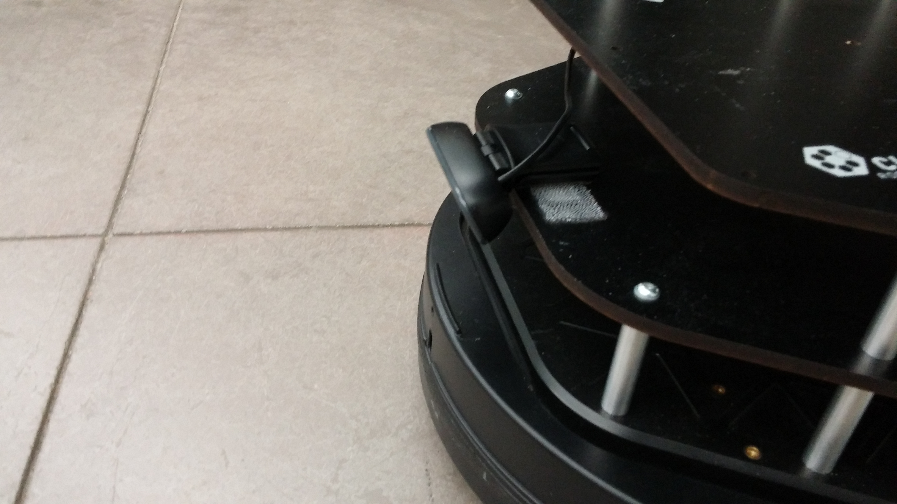

# Line-follower

*CMPUT412 competition 1*

## Setup and building

The project requires ROS Kinetic with the various `turtlebot` and `openni2` packages installed as in eClass. In addition, you must install [gTTS](https://github.com/pndurette/gTTS), e.g. with

    pip install gTTS

The code runs on a Turtlebot 2 with the RGB-D camera in its default position. In addition, a webcam must be placed at the front of the robot, looking down:

The code assumes this webcam can be found at `/dev/video2`.

To get started, first clone this repository:

    git clone git@github.com:CMPUT412-2019/cmput412-competition2.git

Next, run

    cd cmput412-competition2
    catkin build
    source devel/setup.bash

to build the project (if you don't have `catkin build`, try using `catkin_make` instead of the second command).

We now need to create the sound files the robot uses. To do this, run

    cd sound
    python gen.py
    cd ..

which puts the sounds in the `sound/` directory.

## Running the code

Attach the Kobuki base, RGB-D camera, and webcam to your laptop, and run

    roslaunch line_follower turtlebot.launch

This launches everything except the main state machine. To run this, open a new terminal, navigate to the directory containing this Readme, and run

    source devel/setup.bash
    rosrun line_follower competition2.py

## Method

