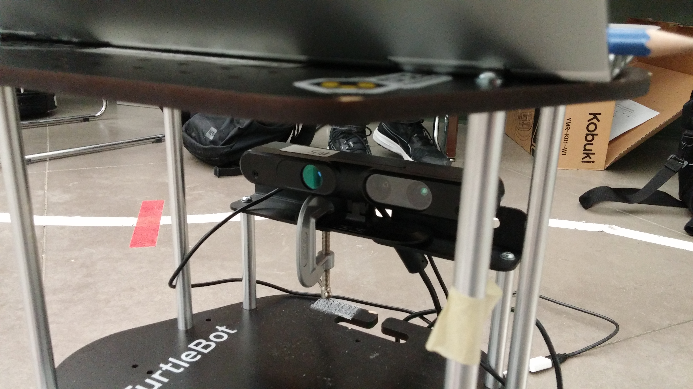
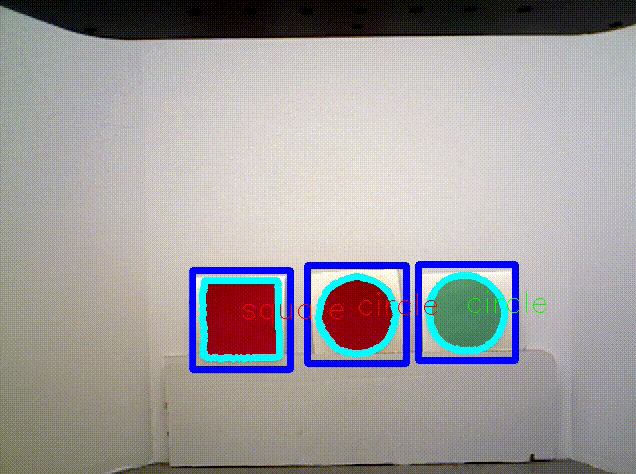

# Line-follower

*CMPUT412 competition 1*

## Setup and building

The project requires ROS Kinetic with the various `turtlebot` and `openni2` packages installed as in eClass. In addition, you must install [gTTS](https://github.com/pndurette/gTTS), e.g. with

    pip install gTTS

The code runs on a Turtlebot 2 with the RGB-D camera in its default position, as shown:

 
In addition, a webcam must be placed at the front of the robot, looking down:

The code assumes this webcam can be found at `/dev/video2`.

To get started, first clone this repository:

    git clone git@github.com:CMPUT412-2019/cmput412-competition2.git

Next, run

    cd cmput412-competition2
    catkin build
    source devel/setup.bash

to build the project (if you don't have `catkin build`, try using `catkin_make` instead of the second command).

We now need to create the sound files the robot uses. To do this, run

    cd sound
    python gen.py
    cd ..

which puts the sounds in the `sound/` directory.

## Running the code

Attach the Kobuki base, RGB-D camera, and webcam to your laptop, and run

    roslaunch line_follower turtlebot.launch

This launches everything except the main state machine. To run this, open a new terminal, navigate to the directory containing this Readme, and run

    source devel/setup.bash
    rosrun line_follower competition2.py

## Method

The project uses a number of components:

### Line following
For line following we use the front-mounted camera, which faces directly at the line: We extract a boolean mask
representing the expected colour of the line (usually white) and locate our movement target by finding the center
of mass of this mask. The robot then moves forward at a constant speed, turning to keep the movement target at the
center of the image (here we use proportional control).

### Changing state at red lines
At various points there are red lines intersecting the white line the robot is following. The robot has to change state
at these lines. For this purpose, we keep track of the red pixels seen by the front-mounted camera, and change state
either when the robot sees 300 or more of these pixels for the first time (if we want to transition as soon as we can
see a red shape), or when the robot has seen 300 or more of these pixels at one point, but stops seeing them for at
least 0.5 seconds (if we want to transition when the robot stops seeing a red shape).

### Turning
There are times when the robot needs to turn by a specific angle (e.g. turn right by 90 degrees). To do this we have a
seperate state that turns the robot using capped proportional control (using the robot's odometry to find the control
target).

### Stopping
At certain points the robot has to stop temporarily. To accomplish this we simply have a state that sends zero-velocity
twist messages a short amount of time.

### Identifying objects
At various points the robot needs to identify objects by colour/shape/distance. We use the back-mounted camera (which
has depth information) for this task. First, red and green masks are made from the image by thresholding for pixels which are mostly red or green. Contours are extracted and simplified from each mask, and shapes are identified by counting the number of vertices in each contour. Since there may occasionally be errors in classification these objects are tracked across several frames using OpenCV's object tracking API. Each object is classified based on the most common shape it has across all frames gathered (with the exception of circles - if an object is classified as a circle more than 20% of the time, but as a square more than 50% of the time, it is considered to be a circle instead of a square). For each object we can then find its real-world position and apply various filtering operations.

### Combining components
These components are combined as follows:
* The first task the robot must accomplish is to follow a white line until it arrives at an intersecting red line,
whereupon it turns 90 degrees to the left and counts the number of red objects it sees within 1 m. This is
accomplished by line following as described above, transitioning into a turn state when the robot stops seeing a red
shape. When the robot stops turning, it extracts the objects in the scene, filters them for redness and distance <= 1 m,
and outputs the count.
* Next, the robot must continue along the line, temporarily stopping when it arrives at a red intersecting line, and
then, when it arrives at a split in the white line (marked by another red line), it takes the path to the left. This
is accomplished by running line-following until the robot stops seeing a red object, then stopping the robot temporarily,
and then resuming line-following until the robot begins seeing a red line (the red line that marks the intersection).
Then, to move to the intersection, we can simply run the line-following code to follow the red line until we can no
longer see it, and then turn left and resume following the white line.
* The rest of the course is traversed in a similar way. See `competition2.py` for additional details.

The figure below depicts the behaviour when turning at a split in the line:

## Nodes

### cam_pixel_to_point

Provides a service to convert depth camera (x,y) pixels to points in the correct camera frame. The service uses the following structure

#### Parameters

- ~in_sim (`bool`): `true` iff node is launched from the simulator.

#### Subscribed topics

- /camera/depth_registered/image_raw (`sensor_msgs/Image`): Camera depth image. If `in_sim` is `true`, use /camera/depth/image_raw instead.
- /camera/rgb/camera_info (`sensor_msgs/CameraInfo`): Camera info for the rgb image.

#### Required tf transforms

- Requires a transform from the camera frame to `base_footprint`.

#### Services

- cam_pixel_to_point (`line_follower/CamPixelToPoint`): given the x,y coordinates of a camera pixel (z is ignored), returns the corresponding point in 3D space.

        geometry_msgs/Vector3 cam_pixel
        ---
        geometry_msgs/PointStamped point

### competition2

Contains the main `smach` state machine which moves the robot.

#### Subscribed topics

- usb_cam_node/image_raw (`sensor_msgs/Image`): Image from the bottom camera (usb webcam)
- /camera/rgb/image_raw (`sensor_msgs/Image`): RGB image from main camera (RGB-D camera)
- pose2d (`geometry_msgs/Pose2D`): Robot pose in the `odom` frame

#### Published topics

- cmd_vel_mux/input/teleop (`geometry_msgs/Twist`): Twist messages to control the robot

#### Services called

- cam_pixel_to_point (`line_follower/CamPixelToPoint`): Used to convert camera pixels from the main camera to points in 3d space
